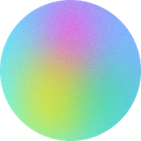
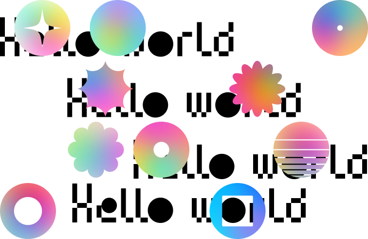

# Projet Drag and drop 2 Web

## Journal de bord de mon projet

### Exemples de markdown

_italique_ s'affiche ainsi : italique
**gras** s'affiche ainsi : gras
**_gras-italique_** s'affiche ainsi : gras-italique
~~barré~~ s'affiche ainsi : barré
exemple de texte

Voici un exemple [de lien](https://docs.framasoft.org/fr/grav/markdown.html)

Plan possible :
1. Un court descriptif de votre idée
2. Captures d'écran des étapes du projet (chronologie + dates)
3. Focus (points de détails du projet : code, image...)
4. La structure du projet (navigation, pages...)

---

## Exemple 01

[Code source](exemple01.html)

[Lien vers la page](https://nicolastilly.github.io/dragndrop2web/exemple01.html)

**Ressources :**

- [https://coolshap.es/](https://coolshap.es/)
- [https://draggabilly.desandro.com/](https://draggabilly.desandro.com/)
- [https://jacobpadilla.com/articles/responsive-font-sizing-in-css](https://jacobpadilla.com/articles/responsive-font-sizing-in-css)
- [https://css-tricks.com/snippets/css/complete-guide-grid/](https://css-tricks.com/snippets/css/complete-guide-grid/)
- [https://cssgrid-generator.netlify.app/](https://cssgrid-generator.netlify.app/)

